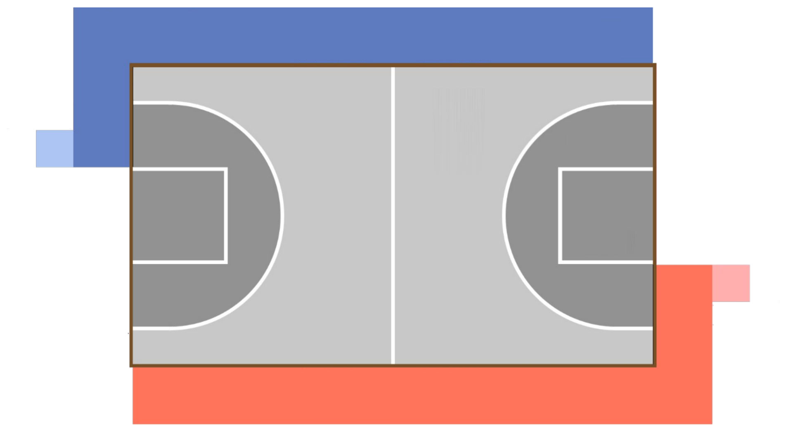
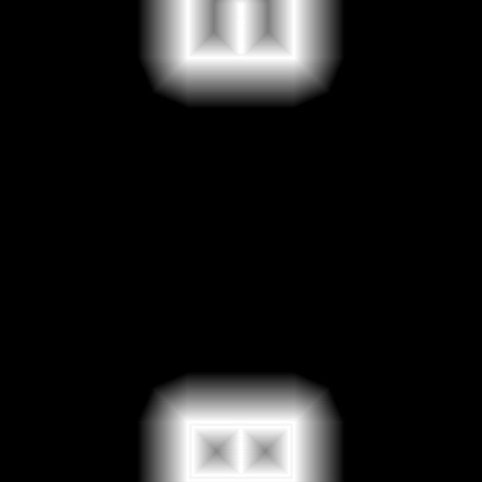
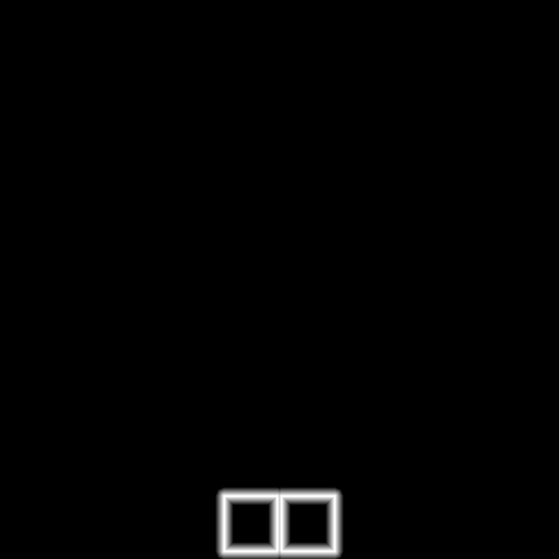

# 救援车
改自b站阿杰老师的[RoboCon25](https://github.com/6-robot/robocon25_proof)

通过鱼眼相机进行纯视觉定位的小车。


# 项目结构

## `robocon25_sim`

仿真环境包。

功能：

- 启动 `3m x 3m` 场地。

- 生成机器人实体。
- 订阅 `/cmd_vel` 控制机器人运动。
- 发布 `/odom` 作为仿真里程计参考。


主要内容：

```text
robocon25_sim/
├── worlds/robocon25.world
├── models/robot.model
├── models/RoboCon25_Field/
├── materials/textures/lines.png
├── meshes/robot.dae
├── src/cmd_vel_model_plugin.cpp
└── launch/gazebo_no_eol.launch.py
```

## `robocon_localization`

视觉定位底层包。

```text
robocon_localization/
├── config/
│   ├── dist_table.txt
│   ├── field_lines.png
│   ├── field_bg.png
│   ├── white_lines.png
│   ├── red_lines.png
│   └── blue_lines.png
├── include/
├── launch/
│   ├── localization.launch
│   ├── calibrate_dist.launch
│   └── hsv_adjust.launch
└── src/
    ├── loc_sidelines.cpp
    ├── omni_mirror_sim.cpp
    ├── load_lines_map.cpp
    ├── calibrate_dist.cpp
    ├── hsv_adjust.cpp
    └── utility/
```

作用：

- `loc_sidelines`：主定位节点，订阅 `/robot/image_raw`，发布 `/robot/pose`。
- `localization.launch`：只启动定位节点本身，用于单独接入已有图像和里程计话题。
- `omni_mirror_sim`：仿真中把 `/sim_camera/image_raw` 转成 `/robot/image_raw`。
- `load_lines_map`：根据 `field_lines.png` 生成匹配模板。
- `calibrate_dist`：距离表标定。
- `hsv_adjust`：颜色阈值调试。

## `robot_bringup`

完整启动包。

```text
robot_bringup/
├── launch/
│   ├── sim.launch.py
│   └── real_localization.launch.py
└── robot_bringup/__init__.py
```

作用：

- `sim.launch.py`：直接启动 Gazebo、小车、全景模拟和视觉定位。
- `real_localization.launch.py`：实物只启动视觉定位。
- 不再包含 `interface_bridge`，因为底层已经直接使用统一话题。

## `robot_control`

- 作用：控制层 Python 包。
- 在此包内编写控制逻辑。


# 使用方法
首先下载该仓库到本地，并配置 ROS 2 环境变量：

```bash
git clone https://github.com/systfe/jyc.git
```

接着打开 `~/.bashrc`，并添加以下内容：

```bash
source /opt/ros/humble/setup.bash
source /usr/share/gazebo-11/setup.bash
source [你的项目路径]/jyc/install/setup.bash
```

## 编译

在终端中打开你的项目路径，并运行以下命令：

```bash
colcon build
source install/setup.bash
```
或者
```bash
cd [你的项目路径]/jyc
colcon build
source install/setup.bash
```

## 启动

```bash
ros2 launch robot_bringup real_localization.launch.py
```

启动后会打开result，match_result，定位窗口（详细见窗口说明）

 - 参数 `image_topic`: 摄像头发布的话题，默认是 `/robot/image_raw`。
 - 参数 `odom_topic`: 底盘里程计发布的话题，默认是 `/robot/odom`。
 - 例:
```bash
ros2 launch robot_bringup real_localization.launch.py image_topic:=/camera/image_raw odom_topic:=/wheel/odom
```
表示启动时使用 `/camera/image_raw` 作为图像话题，使用 `/wheel/odom` 作为里程计话题。


## 仿真启动

```bash
ros2 launch robot_bringup sim.launch.py start_point:=1
```
启动后会打开gazebo仿真世界和result，match_result，定位窗口（详细见窗口说明）

 - 参数`start_point` 可取 `1/2/3/4`，分别代表四个出发点，默认是 `1`。
 - 启动前如果 Gazebo 状态异常，可以先清理旧进程：
```bash
pkill -9 -f gzserver
pkill -9 -f gzclient
pkill -9 -f calibrate_dist
pkill -9 -f omni_mirror_sim
```

启动后会包含：

- Gazebo 场地和小车。

## 移动控制
 - 用 rqt 手动控制：
```bash
ros2 run rqt_robot_steering rqt_robot_steering
```
话题选择`/robot/cmd_vel`

 - 用键盘手动控制：
```bash
ros2 run teleop_twist_keyboard teleop_twist_keyboard /cmd_vel:=/robot/cmd_vel
```


## robot_control
控制层代码


## 窗口说明

### `result`

显示原始图像上的颜色检测和边缘 X 标记。

如果没有 X：

- 检查摄像头图像。
- 检查 HSV/BGR 阈值。
- 使用 `hsv_adjust.launch` 调色。

### `match_result`

显示场地图和投影点。

左上角会显示：

```text
match tracking 12/60 score=...
match hold 0/60 score=...
```

- `tracking`：当前帧匹配质量足够，允许更新位姿。
- `hold`：检测点没有有效匹配模板，本帧不更新位姿。

### `定位`

显示视觉定位位置和里程计（如果有的话）参考。


# 调试

## 话题

对外统一接口如下：

```text
/robot/image_raw   sensor_msgs/msg/Image
/robot/pose        geometry_msgs/msg/PoseStamped
/robot/odom        nav_msgs/msg/Odometry
/robot/cmd_vel     geometry_msgs/msg/Twist
```

说明：
- `/robot/image_raw`：定位图像。仿真由 `omni_mirror_sim` 发布，实物由真实相机发布或 remap。
- `/robot/pose`：视觉定位结果，单位米，坐标系 `map`。
- `/robot/odom`：里程计参考，只用于显示对比。
- `/robot/cmd_vel`：控制命令，仿真和实物控制层都发这个话题。

仿真内部仍有 `/sim_camera/image_raw`，这是 Gazebo 原始相机图像，只作为 `omni_mirror_sim` 的输入，不建议控制层使用。


## 生成模板图


运行
```bash
ros2 run robocon_localization load_lines_map
```
之后，会在根目录下生成`red_lines.png`, `blue_lines.png`,`white_lines.png`三张图片。

把这三个图片放在`yc/src/robocon_localization/config`下。


 - 修改颜色阈值、<u>模板生成逻辑</u>或 `field_lines.png` 后，需要<b>重新生成模板</b>：

 - 三个图片：




## 距离标定

距离表：

```text
robocon_localization/config/dist_table.txt
```

 - 仿真标定：

```bash
ros2 launch robocon_localization calibrate_dist.launch red_ball_x:=0.1
```
打开之后小车前方距离red_ball_x处会有一个红色小球，同时终端会输出小车距离这个红球的像素值，将这个像素值和实际距离写入dist_table.txt中。
控制小球位置分别测完数据之后，重新编译便标定成功。

实车标定：
让真实相机发布 `/robot/image_raw`，然后运行：
```bash
ros2 run robocon_localization calibrate_dist --ros-args \-p image_topic:=/robot/image_raw
```
启动后在车前方0.1/0.2/...的地面放一个红色标记，同时终端会输出小车距离这个标记的像素值。
将这个像素值和实际距离写入dist_table.txt中。

 - 建议距离表覆盖到至少 `2.2m`。场地中心到角落约 `2.12m`，距离表太短会导致远处点只能外推，定位容易偏。
 - 在场地上标定或者仿真标定中，会有可能标定到红色安全区，此时直接把红色安全区遮住即可。


## HSV 调试

```bash
ros2 launch robocon_localization hsv_adjust.launch
```

默认读取 `/robot/image_raw`。

# 原理

当前主流程在：

```text
robocon_localization/src/loc_sidelines.cpp
```

流程：

1. 订阅 `/robot/image_raw`。
2. HSV/BGR 分割洋红、紫色、黑色、红色、蓝色区域。
3. 从图像中心按 `1deg` 射线扫描颜色边缘。
4. 用 `dist_table.txt` 把像素半径换成真实距离。
5. 将检测点投影到 `3m x 3m` 场地坐标。
6. 和 `white_lines.png`、`red_lines.png`、`blue_lines.png` 模板匹配。
7. 通过局部搜索更新视觉位姿。
8. 匹配质量不足时进入 `hold`，保持上一帧位姿。

注意：
- `white_lines.png` 是历史命名，实际表示洋红/紫色边缘模板。
- `/robot/odom` 不参与定位，只在窗口中对比显示。


# 常见问题


